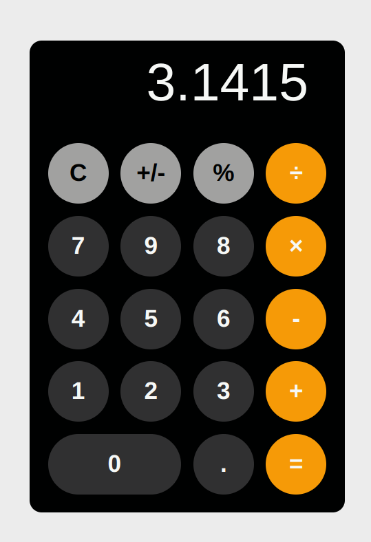

<h1 align="center"> React Calculator ➕</h1>

## 💻 Descrição

Uma simples calculadora. Nela é possível realizar as quatro operações básicas(adição, subtração, multiplicação e divisão) e também o cálculo de porcentagens.
## 🚀 Tecnologias

Esse projeto foi desenvolvido com as seguintes tecnologias:

- [React](https://react.dev/)

## 🔖 Screenshots

 

---

Feito por Bruno Duarte
